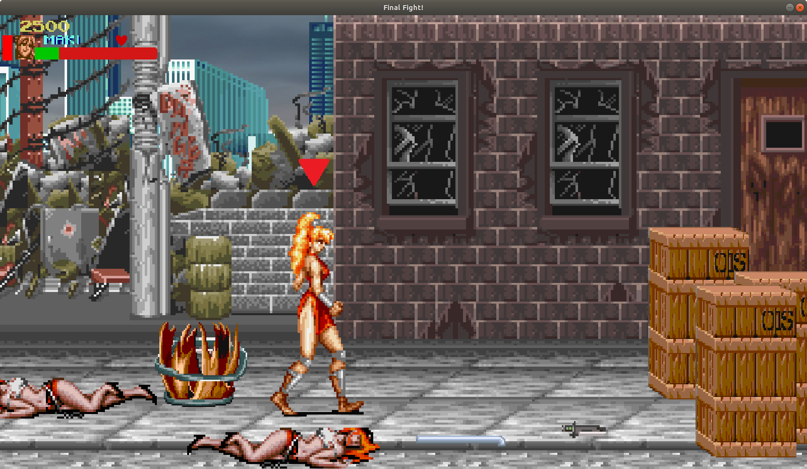
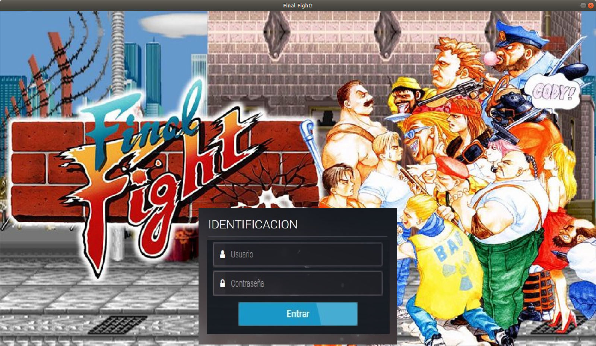
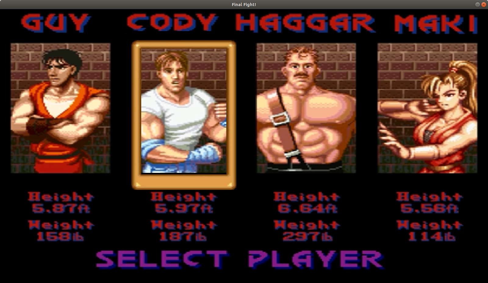

# Final Fight

Juego multijugador similar a [Final Fight](https://es.wikipedia.org/wiki/Final_Fight) creado por [Capcom](http://www.capcom.com/). El mismo fue desarrollado como una aplicación de tipo cliente-servidor para funcionar sobre Linux.

Tested on Ubuntu 20.04 with gcc 9.2.1

    

## Capturas de pantalla

    

    

    

    

## Prerequisitos:

 - SDL2:
    
        $ apt-get install libsdl2-dev
    
 - Valgrind:
 
        $ apt-get install valgrind

 - SLD2-Image (Carga archivos PNG)

        $ apt-get install libsdl2-image-dev
 
 - SDL True Type Font
    
        $ apt-get install libsdl2-ttf-dev
    
 - Xerces:
    
    Descargar los archivos desde [http://xerces.apache.org/xerces-c/download.cgi](http://xerces.apache.org/xerces-c/download.cgi), descomprimir y ejecutar:
    
        $ ./configure
        $ make
        $ sudo make install

 - SDL2 Mixer:

        $ apt-get install libsdl2-mixer-dev
    
 - Debug librería estándar (opcional):
 
        $ apt-get install libstdc++6-8-dbg

# Build

       mkdir build
       cd build
       cmake ..
       make

# Server

       ./server

# Client

       ./client 127.0.0.1  5000

# User/Pass

[Configuration.xml](Configuration.xml)

